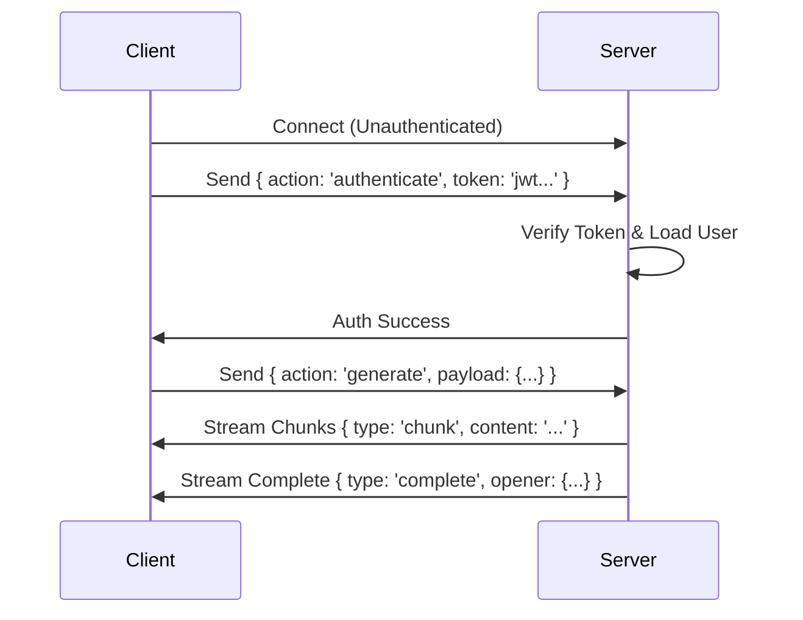

## Magic Openers Backend – Module Design Guide

### 1. Purpose and Scope

This document describes the architecture, patterns, and implementation of the **Magic Openers** backend module.
It is intended for backend engineers working on or integrating with this feature, and should be read together with:

- `CONTROLLER_PATTERN_STANDARD.md` (global controller/route pattern)
- `BACKEND_TECH_STACK_COMPLETE.md` (overall backend stack)
- `analytics/COST_TRACKING_&_ANALYTICS.md` (AI cost tracking and analytics)

The sections below cover:

- Tech stack and dependencies used by the module.
- Architecture and design patterns (services, controllers, routes, DI).
- WebSocket protocol and streaming behavior.
- Database schema and data model.
- Validation, error handling, logging, testing, and deployment considerations.

---

## 🛠️ Tech Stack

### Core Technologies

- **Runtime:** Node.js 22 (ESM modules)
- **Framework:** Express.js 5.1
- **Language:** TypeScript (Strict Mode)
- **Database:** PostgreSQL (Neon)
- **ORM:** Prisma
- **WebSocket:** Native `ws` library
- **Authentication:** Clerk (JWT tokens)
- **Logging:** Pino
- **Validation:** Zod
- **Rate Limiting:** rate-limiter-flexible

### AI Integration

- **Primary:** Google Gemini Flash
- **Fallbacks:** OpenAI GPT-4o, Anthropic Claude Sonnet
- **Strategy Pattern:** Robust provider selection with automatic fallback

### Development Tools

- **Testing:** Jest
- **Linting:** ESLint + Prettier
- **Type Checking:** `tsc --noEmit`

---

## 🏗️ Architecture & Patterns

### 1. Functional Philosophy

**Key Principle:** Absolute avoidance of `class` syntax for business logic. Services are factory functions; controllers are higher-order async functions.

```typescript
// ✅ GOOD: Factory Function
export const createMagicOpenerService = ({ prisma, aiStrategy }) => {
  return {
    async generateOpenerStream(...) { ... },
    async handleInteraction(...) { ... },
  };
};

// ❌ BAD: Class Syntax
export class MagicOpenerService {
  constructor(private prisma, private aiStrategy) {}
  async generateOpenerStream(...) { ... }
}
```

**Location:** `backend/src/modules/magic-opener/magic-opener.service.ts`

---

### 2. Service Layer Pattern (Factory Functions)

**Pattern:** Factory functions that explicitly receive dependencies via an object argument.

**Structure:**

```typescript
// 1. Define Dependencies
export type MagicOpenerServiceDependencies = {
  prisma: PrismaClient;
  aiStrategy: AiStrategy;
  costTracker?: CostTrackerService;
};

// 2. Factory function receives dependencies and returns public API
export const createMagicOpenerService = ({
  prisma,
  aiStrategy,
  costTracker,
}: MagicOpenerServiceDependencies) => {
  const logger = createServiceLogger('magic-opener');

  // Private helper functions (closure scoped)
  const _buildPrompt = (params: any): string => {
    // ...logic
  };

  // Public API
  return {
    async generateOpenerStream({ ... }) { ... },
    async handleInteraction({ ... }) { ... },
    async getOpeners(...) { ... },
  };
};

// 3. Export Service Type
export type MagicOpenerService = ReturnType<typeof createMagicOpenerService>;
```

**Benefits:**

- ✅ Explicit dependencies (Dependency Injection).
- ✅ Easy testing (Mocking interfaces).
- ✅ Functional paradigm/Closure encapsulation.
- ✅ No hidden state (`this` context).

**Location:** `backend/src/modules/magic-opener/magic-opener.service.ts`

---

### 3. Controller Pattern (Higher-Order Functions)

**Pattern:** Individual, exported higher-order functions that inject the service.

**Structure:**

```typescript
// Higher-order function receiving the service, returning the handler
export const getOpeners =
  (magicOpenerService: MagicOpenerService) =>
  async (req: Request, res: Response, next: NextFunction) => {
    try {
      const userId = req.user!.id;
      const { page, limit } = req.query as { page: string; limit: string };

      const result = await magicOpenerService.getOpeners(userId, {
        page: parseInt(page, 10),
        limit: parseInt(limit, 10),
      });

      success(res, {
        openers: result.data,
        pagination: result.pagination,
      });
    } catch (error) {
      next(error);
    }
  };
```

**Usage in Router:**

```typescript
router.get(
  "/",
  createValidationMiddleware(getOpenersQuerySchema, "query"),
  getOpeners(magicOpenerService) // Inject service directly
);
```

**Benefits:**

- ✅ Maximum clarity and readability.
- ✅ Functional purity (no `this`).
- ✅ Explicit dependencies in the router definition.

For the canonical controller pattern standard used across the backend, see `CONTROLLER_PATTERN_STANDARD.md`.

**Location:** `backend/src/modules/magic-opener/magic-opener.controller.ts`

---

### 4. Routes Pattern (Factory Functions)

**Pattern:** Factory function receiving dependencies and returning an Express Router.

**Structure:**

```typescript
export const createMagicOpenerRoutes = ({
  magicOpenerService,
}: {
  magicOpenerService: MagicOpenerService;
}) => {
  const router = Router();

  // Middleware
  router.use(clerkAuth);
  router.use(loadUser);

  // Routes
  router.get(
    "/",
    createValidationMiddleware(getOpenersQuerySchema, "query"),
    getOpeners(magicOpenerService)
  );

  router.post(
    "/:openerId/like",
    createValidationMiddleware(interactionParamsSchema, "params"),
    likeOpener(magicOpenerService)
  );

  return router;
};
```

**Usage in `app.ts`:**

```typescript
app.use(
  "/api/v1/magic-openers",
  createMagicOpenerRoutes({ magicOpenerService })
);
```

**Location:** `backend/src/modules/magic-opener/magic-opener.routes.ts`

---

### 5. Dependency Injection Root

**Principle:** All dependencies are created in `server.ts` and passed down through factory functions. This is the **Composition Root**.

**Structure:**

```typescript
// server.ts - THE ONLY PLACE WHERE SERVICE INSTANCES ARE CREATED
const aiClient = createAiClient({ config: aiClientConfig });
const userService = createUserService(prisma);
const aiStrategy = createAiStrategy(aiClient, { ... });
const magicOpenerService = createMagicOpenerService({
  prisma,
  aiStrategy,
});

// app.ts - Receives all dependencies as parameters
const app = createApp({
  userService,
  webhookService,
  magicOpenerService,
});
```

**Location:** `backend/src/server.ts`

---

## 🔌 WebSocket Implementation

### 1. Architecture

**Technology:** Native `ws` library with a custom authentication flow (Post-Upgrade Auth).

**Flow:**



**Location:** `backend/src/core/websocket/websocket-server.ts`

---

### 2. Authentication Flow

**Post-Upgrade Authentication:**

- We accept the socket connection _before_ authentication.
- Auth happens via the first message.
- **Reason:** React Native WebSocket implementation usually does not support custom headers during the handshake.
- **Timeout:** 10 seconds to authenticate, or the socket closes.

```typescript
// Client connects
wss.on("connection", (ws: AuthenticatedWebSocket, request) => {
  ws.isAuthenticated = false; // Initial state

  // Authentication timeout
  const authTimeout = setTimeout(() => {
    if (!ws.isAuthenticated) {
      ws.close(1008, "Authentication timeout");
    }
  }, 10000);

  ws.on("message", async (message: Buffer) => {
    const { action, payload } = validatedMessage.data;

    if (action === "authenticate") {
      const { token } = payload;
      const { userId } = await verifyToken(token); // Clerk verify

      // Load internal DB user
      const user = await userService.getUserByClerkId(userId);

      // Authenticate WebSocket
      ws.isAuthenticated = true;
      ws.auth = { userId: user.id };
      clearTimeout(authTimeout);
    }
  });
});
```

---

### 3. Rate Limiting

**Per-User Rate Limiting:**
Used for generation requests.

```typescript
const openerRateLimiter = new RateLimiterMemory({
  points: env.WS_RATE_LIMIT_POINTS, // e.g., 10
  duration: env.WS_RATE_LIMIT_DURATION_SEC, // e.g., 60
});

// Check before generation
const rateLimitKey = `generate-opener:${userId}`;
await openerRateLimiter.consume(rateLimitKey);
```

**Per-IP Rate Limiting:**
Used for authentication attempts to prevent abuse.

---

### 4. Message Protocol

**Incoming Messages (Client → Server):**

```typescript
interface AuthenticateMessage {
  action: "authenticate";
  payload: { token: string };
}

interface GenerateMessage {
  action: "generate";
  streamId: string; // Client-generated UUID
  payload: {
    aiStyle?: string;
    customTwist?: string;
    locale: string;
  };
}

interface PingMessage {
  type: "ping";
}
```

**Outgoing Messages (Server → Client):**

```typescript
interface ChunkResponse {
  type: "chunk";
  streamId: string;
  content: string;
}

interface CompleteResponse {
  type: "complete";
  streamId: string;
  opener: AIGeneratedOpener; // The full saved DB object
}

interface ErrorResponse {
  type: "error";
  streamId: string;
  code: WebSocketErrorCode;
  message: string;
}
```

**Location:** `backend/src/core/websocket/websocket.types.ts`

---

### 5. Streaming Implementation

**AI Streaming Logic:**

```typescript
const { finalText, promptTokens, completionTokens } =
  await provider.streamText({
    prompt,
    system: SYSTEM_MESSAGE,
    onChunk: (chunk: string) => {
      // Send chunk to client immediately
      const chunkResponse: ChunkResponse = {
        type: 'chunk',
        streamId,
        content: chunk,
      };
      ws.send(JSON.stringify(chunkResponse));
    },
    temperature: 0.8,
    abortSignal,
  });

// After stream completes, save to database
const savedOpener = await prisma.aIGeneratedOpener.create({
  data: { userId, text: finalText, ... },
});

// Send complete message
ws.send(JSON.stringify({
  type: 'complete',
  streamId,
  opener: savedOpener,
}));
```

**Abort Signal:**
The system supports client-side cancellation via `AbortController`. If a "cancel" message is received, the AI generation halts immediately.

---

### 6. Heartbeat (Ping/Pong)

**Reasoning:**
Native `ws.ping()` frames are often not exposed or supported by React Native clients. We use a JSON-level heartbeat.

```typescript
if (rawMessage.type === "ping") {
  ws.send(JSON.stringify({ type: "pong" }));
  return;
}
```

---

## 🗄️ Database Schema

### Prisma Models

**Location:** `backend/prisma/schema.prisma`

```prisma
model AIGeneratedOpener {
  id          String   @id @default(cuid())
  userId      String   @map("user_id")
  user        User     @relation(fields: [userId], references: [id], onDelete: Cascade)

  // Generated content
  text        String   @db.Text
  locale      String

  // Generation context
  aiStyle     String?  @map("ai_style")
  customTwist String?  @map("custom_twist") @db.Text
  prompt      String?  @db.Text

  // AI metadata
  model       String

  createdAt   DateTime @default(now()) @map("created_at")
  updatedAt   DateTime @updatedAt @map("updated_at")
  deletedAt   DateTime? @map("deleted_at")

  // Provider metadata (tokens, costs, etc.)
  providerMetadata Json? @map("provider_metadata")

  interactions UserOpenerInteraction[]

  @@index([userId, createdAt])
  @@index([deletedAt])
  @@map("ai_generated_openers")
}

model UserOpenerInteraction {
  id        String   @id @default(cuid())
  userId    String   @map("user_id")
  openerId  String   @map("opener_id")

  user      User              @relation(fields: [userId], references: [id], onDelete: Cascade)
  opener    AIGeneratedOpener @relation(fields: [openerId], references: [id], onDelete: Cascade)

  type      InteractionType

  createdAt DateTime @default(now()) @map("created_at")

  @@index([userId, createdAt])
  @@unique([userId, openerId, type]) // Idempotency
  @@map("user_opener_interactions")
}

enum InteractionType {
  LIKED
  DISLIKED
  BOOKMARKED
  COPIED_TO_CLIPBOARD
  SHARED
  PINNED
}
```

---

## 🔐 Authentication & Authorization

### 1. Clerk Integration

**JWT Verification:**

```typescript
import { verifyToken } from "@clerk/backend";

// In middleware or WS auth handler
const { userId } = await verifyToken(token);
```

**User Mapping:**
Clerk IDs (`user_2p...`) are mapped to internal DB CUIDs via the `loadUser` middleware.

**Location:** `backend/src/modules/auth/loadUser.middleware.ts`

---

## ✅ Validation

### 1. Zod Schemas

**Structure:**

```typescript
// Params validation
export const interactionParamsSchema = z.object({
  openerId: z.cuid("Invalid opener ID format"),
});

// Query validation
export const getOpenersQuerySchema = z.object({
  page: z.coerce.number().int().min(1).default(1),
  limit: z.coerce.number().int().min(1).max(100).default(20),
});

// WS Message Validation
export const incomingMessageSchema = z.object({
  action: z.enum(["authenticate", "generate", "cancel"]),
  streamId: z.string().uuid().optional(),
  payload: z.record(z.unknown()),
});
```

**Location:** `backend/src/modules/magic-opener/magic-opener.validation.ts`

---

### 2. Validation Middleware

**Usage:**

```typescript
router.get(
  "/",
  createValidationMiddleware(getOpenersQuerySchema, "query"),
  handler
);
```

**Location:** `backend/src/core/middleware/validation.middleware.ts`

---

## 🚨 Error Handling

### 1. Error Types

**Http:** `AppError` class extends `Error` with `statusCode` and `code`.
**WebSocket:** `WebSocketErrorCode` enum.

### 2. Global Error Handler

Catches all errors in Express routes, converts them to standard JSON format, and logs them via Pino.

**Location:** `backend/src/core/error/errorHandler.ts`

### 3. WebSocket Error Responses

Factory function to create standardized error frames for the socket.

```typescript
const errorResponse = createAppErrorResponse(
  "WS_INTERNAL_ERROR",
  error.message,
  streamId
);
ws.send(JSON.stringify(errorResponse));
```

---

## 📊 Logging

**Library:** Pino

**Configuration:**

- JSON in production.
- Pretty print in development.
- HTTP Request logging enabled.

**Usage:**

```typescript
const logger = createServiceLogger("magic-opener");
logger.info({ userId, streamId }, "Starting generation");
```

---

## 🧪 Testing Strategy

### 1. Unit Tests (Service)

**Approach:** Mock Prisma and AI Strategy.

```typescript
describe("MagicOpenerService", () => {
  let service: MagicOpenerService;
  // ... mocks setup

  beforeEach(() => {
    service = createMagicOpenerService({
      prisma: mockPrisma,
      aiStrategy: mockAiStrategy,
    });
  });

  it("should generate opener stream", async () => { ... });
});
```

**Location:** `backend/src/modules/magic-opener/magic-opener.service.test.ts`

### 2. Integration Tests

Using `supertest` for HTTP endpoints and a test WebSocket client for streaming flows.

---

## 🚀 Deployment Config

### Environment Variables

**Required in `.env`:**

```bash
# Database
DATABASE_URL=postgresql://...

# Authentication
CLERK_SECRET_KEY=sk_...

# AI Providers
GEMINI_API_KEY=...
OPENAI_API_KEY=...
ANTHROPIC_API_KEY=...

# AI Strategy Config
AI_PROVIDER_STRATEGY_PRIMARY=gemini-flash
AI_PROVIDER_STRATEGY_FALLBACKS=gpt-4o,claude-sonnet

# WebSocket Limits
WS_RATE_LIMIT_POINTS=10
WS_RATE_LIMIT_DURATION_SEC=60
```

**Graceful Shutdown:**
The server handles `SIGTERM`/`SIGINT` to close the HTTP server, disconnect Prisma, and terminate WebSocket connections gracefully.

---

## 📁 Folder Structure

```
backend/src/modules/magic-opener/
├── magic-opener.controller.ts      # HTTP Handlers (HOFs)
├── magic-opener.routes.ts          # Router definition (Factory)
├── magic-opener.service.ts         # Business logic (Factory)
├── magic-opener.service.test.ts    # Service unit tests
├── magic-opener.integration.test.ts# Integration tests (HTTP/WS flows)
├── magic-opener.types.ts           # TypeScript interfaces
├── magic-opener.validation.ts      # Zod schemas
└── prompts/                        # AI system prompts
```
