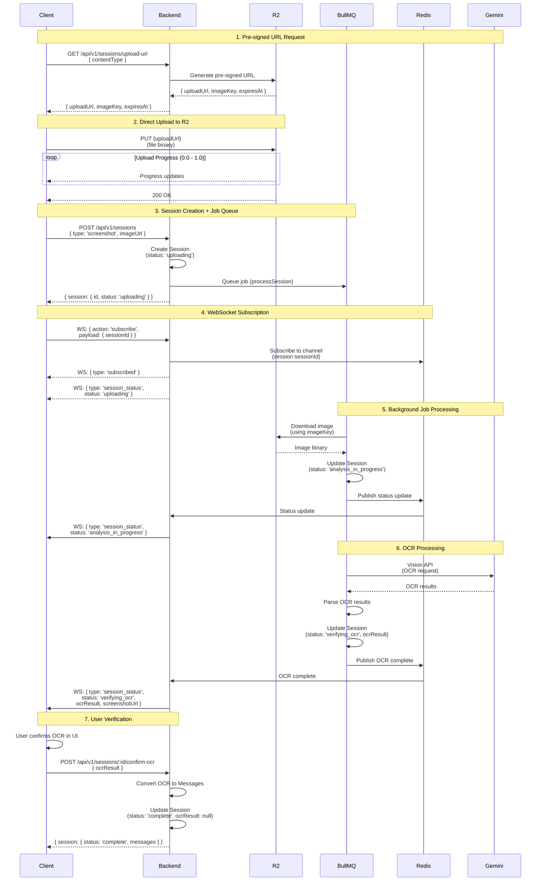

## Sessions Upload Flow – Architecture

### 1. Purpose and Status

This document describes the end-to-end upload and OCR flow for the **Sessions** feature, from the moment a user selects a screenshot to the point where OCR is confirmed and messages are created.
It is intended for backend engineers working on sessions, jobs, WebSocket updates, or R2/Gemini integrations.

- **Status:** Implemented; details here reflect the intended architecture for maintenance and future improvements.
- **Scope:** HTTP APIs, R2 pre-signed URLs, BullMQ jobs, Redis pub/sub, WebSocket updates, OCR processing, retries, and status transitions.

---

### 2. High-Level Overview

At a high level, the flow:

- Issues a pre-signed upload URL to the client (R2).
- Uploads the image directly from the client to R2.
- Creates a session and enqueues an OCR job.
- Streams status updates via WebSocket (backed by Redis pub/sub).
- Runs OCR in the background (Gemini Vision) and updates the session.
- Lets the user verify OCR and converts OCR results into messages.

---

---

### 3. Complete Flow Diagram

### Mermaid Sequence Diagram



---

---

### 4. Flow Steps (Detailed)

### Step 1: Pre-signed URL Request

```
Client                          Backend                          R2
  |                                |                              |
  |-- GET /api/v1/sessions/upload-url -->|                        |
  |     { contentType: "image/jpeg" }    |                        |
  |                                |                              |
  |                                |-- Generate pre-signed URL -->|
  |                                |                              |
  |<-- { uploadUrl, imageKey, expiresAt } --|                    |
  |                                |                              |
```

**Details:**

- **Request:** `GET /api/v1/sessions/upload-url?contentType=image/jpeg`
- **Response:** `{ uploadUrl, imageKey, expiresAt }`
- **Timing:** < 100ms
- **Error Handling:** 400 (invalid contentType), 401 (unauthorized), 500 (R2 error)

---

### Step 2: Direct Upload to R2

```
Client                          R2
  |                              |
  |-- PUT {uploadUrl} ---------->|
  |     (file binary)          |
  |                              |
  |<-- Progress (0.0 - 1.0) ----|
  |                              |
  |<-- 200 OK -------------------|
  |                              |
```

**Details:**

- **Method:** `PUT` to pre-signed URL
- **Progress Tracking:** XMLHttpRequest `upload.onprogress`
- **Timing:**
  - 2MB image: 2-5s
  - 10MB image: 5-10s
- **Error Handling:** Retry 3x (immediate, 2s, 5s)

---

### Step 3: Session Creation + Job Queue

```
Client                          Backend                          BullMQ
  |                                |                              |
  |-- POST /api/v1/sessions ------>|                              |
  |     { type, imageUrl }         |                              |
  |                                |-- Create Session ----------->|
  |                                |   (status: 'uploading')      |
  |                                |                              |
  |                                |-- Queue job (processSession)->|
  |                                |                              |
  |<-- { session } ----------------|                              |
  |     { id, status: 'uploading' }|                              |
  |                                |                              |
```

**Details:**

- **Request:** `POST /api/v1/sessions { type: 'screenshot', imageUrl }`
- **Response:** Session with `status: 'uploading'`
- **Job Queue:** BullMQ job queued immediately
- **Timing:** < 200ms

---

### Step 4: WebSocket Subscription

```
Client                          Backend                          Redis
  |                                |                              |
  |-- WS: subscribe -------------->|                              |
  |     { action: 'subscribe',     |                              |
  |       payload: { sessionId } }  |                              |
  |                                |-- Subscribe to channel ---->|
  |                                |   (session:sessionId)        |
  |                                |                              |
  |<-- WS: subscribed --------------|                              |
  |                                |                              |
  |<-- WS: session_status ---------|                              |
  |     { status: 'uploading' }    |                              |
  |                                |                              |
```

**Details:**

- **Message:** `{ action: 'subscribe', payload: { sessionId } }`
- **Response:** `{ type: 'subscribed' }`
- **Initial Status:** `{ type: 'session_status', status: 'uploading' }`
- **Timing:** < 100ms

---

### Step 5: Background Job Processing

```
BullMQ                          R2                          Backend                          Redis
  |                              |                            |                              |
  |-- Download image ----------->|                            |                              |
  |     (using imageKey)         |                            |                              |
  |                              |                            |                              |
  |<-- Image binary -------------|                            |                              |
  |                              |                            |                              |
  |-- Update Session ----------->|                            |                              |
  |     (status: 'analysis_in_progress')|                      |                              |
  |                              |                            |                              |
  |                              |                            |-- Publish to Redis --------->|
  |                              |                            |   (status update)            |
  |                              |                            |                              |
  |                              |<-- Status update ----------|                              |
  |                              |                            |                              |
```

**Details:**

- **Worker:** BullMQ worker picks up job
- **Download:** Image from R2 using `imageKey`
- **Status Update:** `analysis_in_progress`
- **Pub/Sub:** Redis pub/sub → WebSocket → Client
- **Timing:** < 500ms (download + status update)

---

### Step 6: OCR Processing

```
BullMQ                          Gemini                       Backend                          Redis
  |                              |                            |                              |
  |-- Vision API (OCR) --------->|                            |                              |
  |                              |                            |                              |
  |<-- OCR results --------------|                            |                              |
  |                              |                            |                              |
  |-- Parse OCR results ---------|                            |                              |
  |                              |                            |                              |
  |-- Update Session ----------->|                            |                              |
  |     (status: 'verifying_ocr',|                            |                              |
  |      ocrResult)              |                            |                              |
  |                              |                            |                              |
  |                              |                            |-- Publish to Redis --------->|
  |                              |                            |   (OCR complete)             |
  |                              |                            |                              |
  |                              |<-- OCR complete ------------|                              |
  |                              |                            |                              |
```

**Details:**

- **API:** Gemini Vision API (2.5 Flash)
- **Processing:** Parse OCR results into structured format
- **Status Update:** `verifying_ocr` with `ocrResult` array
- **Pub/Sub:** Redis pub/sub → WebSocket → Client
- **Timing:** 3-10s (depends on image complexity)

---

### Step 7: User Verification

```
Client                          Backend
  |                                |
  |-- User confirms OCR in UI ----->|
  |                                |
  |-- POST /api/v1/sessions/:id/confirm-ocr -->|
  |     { ocrResult }              |
  |                                |
  |                                |-- Convert OCR to Messages -->|
  |                                |                              |
  |                                |-- Update Session ----------->|
  |                                |   (status: 'complete',       |
  |                                |    ocrResult: null)           |
  |                                |                              |
  |<-- { session } ----------------|
  |     { status: 'complete',      |
  |       messages,                |
  |       ocrResult: null }         |
  |                                |
```

**Details:**

- **Request:** `POST /api/v1/sessions/:id/confirm-ocr { ocrResult }`
- **Processing:** Convert OCR items to Message entities
- **Status Update:** `complete`, `ocrResult` set to `null`
- **Response:** Session with messages array
- **Timing:** < 300ms

---

---

### 5. Error Handling Flows

### Upload Failure (R2 Error)

```
Client                          R2
  |                              |
  |-- PUT {uploadUrl} ---------->|
  |     (file binary)            |
  |                              |
  |<-- 500 Error ----------------|
  |                              |
  |-- Retry (immediate) -------->|
  |                              |
  |<-- 500 Error ----------------|
  |                              |
  |-- Wait 2s ------------------>|
  |-- Retry -------------------->|
  |                              |
  |<-- 500 Error ----------------|
  |                              |
  |-- Wait 5s ------------------>|
  |-- Retry -------------------->|
  |                              |
  |<-- 500 Error ----------------|
  |                              |
  |-- Show error to user ------->|
  |-- Update status: 'error' --->|
  |                              |
```

**Retry Strategy:**

- **Attempts:** 3
- **Delays:** Immediate, 2s, 5s
- **User Action:** Show error message, allow manual retry

---

### OCR Failure (Gemini API Error)

```
BullMQ                          Gemini                       Backend                          Redis
  |                              |                            |                              |
  |-- Vision API (OCR) --------->|                            |                              |
  |                              |                            |                              |
  |<-- 500 Error ----------------|                            |                              |
  |                              |                            |                              |
  |-- Wait 5s ------------------>|                            |                              |
  |-- Retry OCR ---------------->|                            |                              |
  |                              |                            |                              |
  |<-- 500 Error ----------------|                            |                              |
  |                              |                            |                              |
  |-- Update Session ----------->|                            |                              |
  |     (status: 'error')        |                            |                              |
  |                              |                            |                              |
  |                              |                            |-- Publish error ------------->|
  |                              |                            |                              |
  |                              |<-- Error event -------------|                              |
  |                              |                            |                              |
```

**Retry Strategy:**

- **Attempts:** 2
- **Delay:** 5s between attempts
- **Error Code:** `OCR_FAILED`
- **WebSocket:** Client receives `{ type: 'session_error', error: { code: 'OCR_FAILED' } }`

---

### WebSocket Disconnect

```
Client                          Backend                          Redis
  |                                |                              |
  |<-- Connection lost -------------|                              |
  |                                |                              |
  |-- Wait 1s -------------------->|                              |
  |-- Reconnect ------------------>|                              |
  |                                |                              |
  |<-- Connection failed ----------|                              |
  |                                |                              |
  |-- Wait 2s -------------------->|                              |
  |-- Reconnect ------------------>|                              |
  |                                |                              |
  |<-- Connected ------------------|                              |
  |                                |                              |
  |-- Re-subscribe --------------->|                              |
  |     { action: 'subscribe' }    |                              |
  |                                |                              |
  |-- GET /api/v1/sessions/:id -->|                              |
  |     (sync state)               |                              |
  |                                |                              |
  |<-- { session } ----------------|                              |
  |                                |                              |
```

**Retry Strategy:**

- **Attempts:** Infinite
- **Delays:** Exponential backoff (1s, 2s, 4s, 8s, 16s, 30s max)
- **Recovery:** Re-subscribe + sync state via GET request

---

---

### 6. Timing Estimates

| Step                   | Component       | Timing  | Notes                                         |
| ---------------------- | --------------- | ------- | --------------------------------------------- |
| 1. Pre-signed URL      | Backend → R2    | < 100ms | Fast API call                                 |
| 2. Upload              | Client → R2     | 2-10s   | Depends on file size (2MB: 2-5s, 10MB: 5-10s) |
| 3. Session Creation    | Backend         | < 200ms | Database write + job queue                    |
| 4. WebSocket Subscribe | Backend → Redis | < 100ms | Fast subscription                             |
| 5. Job Processing      | BullMQ → R2     | < 500ms | Image download                                |
| 6. OCR Processing      | BullMQ → Gemini | 3-10s   | Depends on image complexity                   |
| 7. User Verification   | Backend         | < 300ms | Database update                               |

**Total End-to-End:** ~5-20s (excluding user verification)

---

---

### 7. Retry Strategies Summary

| Component           | Attempts | Delays                       | Conditions                  |
| ------------------- | -------- | ---------------------------- | --------------------------- |
| Upload Failure      | 3        | Immediate, 2s, 5s            | R2 errors, network failures |
| OCR Failure         | 2        | 5s between attempts          | Gemini API errors           |
| WebSocket Reconnect | Infinite | 1s, 2s, 4s, 8s, 16s, 30s max | Connection lost             |
| API Request Failure | 2        | 1s delay                     | 5xx errors                  |

---

---

### 8. Status Transitions

```
pending_user_input
  ↓ (user selects image)
previewing_screenshot
  ↓ (user confirms)
uploading
  ↓ (upload complete, job queued)
analysis_in_progress
  ↓ (OCR complete)
verifying_ocr
  ↓ (user confirms OCR)
complete

Any step → error (on failure)
error → pending_user_input | complete (recovery)
```

---

---

### 9. Security Considerations

1. **Pre-signed URLs:**

   - 15-minute expiry
   - Content-type validation
   - User-specific paths (`sessions/{userId}/...}`)

2. **WebSocket:**

   - JWT authentication required
   - Session ownership validation
   - Rate limiting per user

3. **Job Queue:**
   - User context in job payload
   - Authorization checks in worker
   - Error logging (no sensitive data)

---

## 10. References

- [Sessions API Contract](../SESSIONS_API_CONTRACT.md) – complete API specification.
- [WebSocket Protocol](./WEBSOCKET.md) – WebSocket protocol specification.
- [RAG Design](./RAG.md) – RAG architecture for suggestions.
- [Prisma Schema Draft](./PRISMA_SCHEMA_DRAFT.md) – Sessions and knowledge base schema.

---

---

### 11. Iterative Conversation Flow (Post-OCR)

Once a session is in the `complete` status (OCR confirmed), the user can continue to iteratively build the conversation:

```
Initial State: Session with OCR messages
  ↓
User: Generate suggestion
  ↓
Backend: RAG retrieval (2-message context)
Backend: Generate 1 suggestion
  ↓
User: Chooses suggestion or adds a custom message
  ↓
Backend: POST /api/v1/sessions/:id/messages (new message)
  ↓
User: Contact replies (adds another message)
  ↓
Backend: POST /api/v1/sessions/:id/messages (new message)
  ↓
User: Generate suggestion (again)
  ↓
Backend: RAG retrieval (4-message context) ← EXTENDED CONTEXT
Backend: Generate 1 new suggestion
  ↓
User: Continues iteratively...
```

**Key points:**

- Every `generate-suggestions` request uses **ALL messages** up to that point
- RAG retrieval quality improves with more context
- There is no limit on the number of iterations
- Each request returns **1 suggestion** (for more suggestions, send multiple requests)

**Implementation:**

```typescript
// generateSuggestions ALWAYS uses ALL messages in the session
const session = await prisma.session.findUnique({
  where: { id: sessionId },
  include: {
    messages: {
      orderBy: { timestamp: "asc" }, // Chronological order
    },
  },
});

// RAG query is built from the FULL message history
const conversationContext = session.messages
  .map((m) => `${m.author}: ${m.text}`)
  .join("\n");

// RAG retrieval with extended context
const relevantChunks = await ragService.retrieve(conversationContext, {
  topK: 5,
  filters: {
    phase: detectConversationPhase(session.messages.length), // Dynamic phase
  },
});
```

---

---

### 12. Additional Notes

- Upload progress tracked client-side (XMLHttpRequest)
- Status updates via WebSocket (real-time)
- Fallback to polling if WebSocket fails (GET /api/v1/sessions/:id every 2s)
- OCR results temporary - removed after user confirmation
- All timestamps in Unix milliseconds (frontend format)
- **Iterative flow:** `generate-suggestions` always uses ALL messages from session
